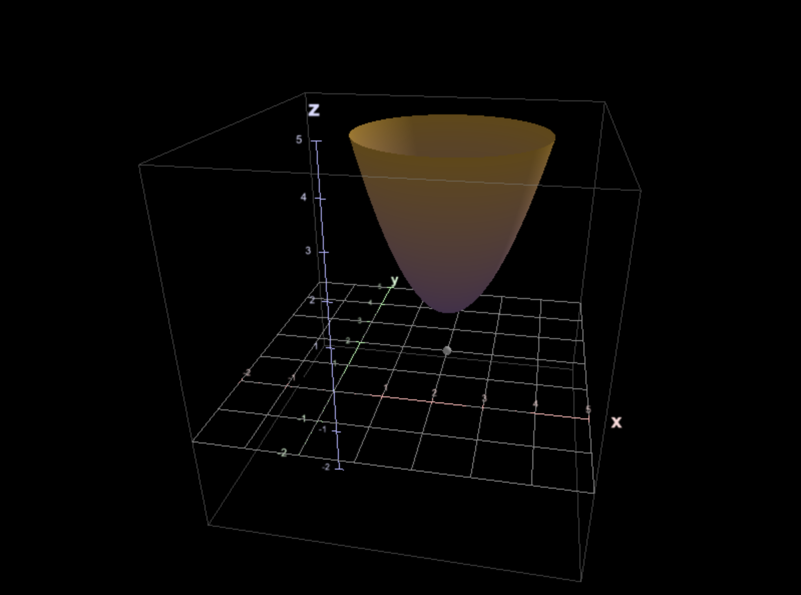

# Mafs3D

An unofficial 3D version of the excellent [Mafs](https://mafs.dev) library

It is a set of react components for building 3D math visualizations

## Getting Started
```bash
pnpm add mafs-3d
```

### Example
```tsx
import { Mafs3D, Coordinates, Border, Plot, Point } from 'mafs-3d';

export default function App() {
  return (
    <Mafs3D viewBox={{ x: [-2, 5], y: [-2, 5], z: [-2, 5] }}>
        <Coordinates />
        <Border />
        <Plot z={(x, y) => (x - 2) ** 2 + (y - 2) ** 2 + 1} />
        <Point x={2} y={2} z={0} />
    </Mafs3D>
  );
}
```


